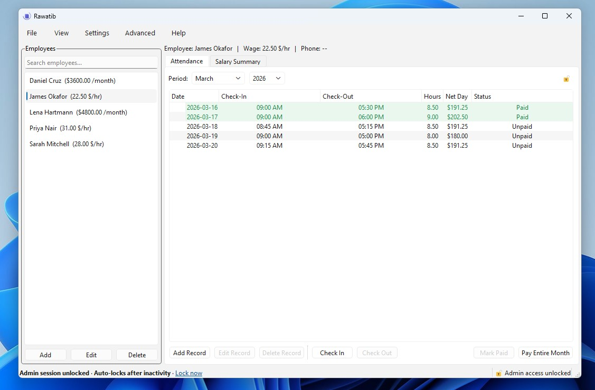
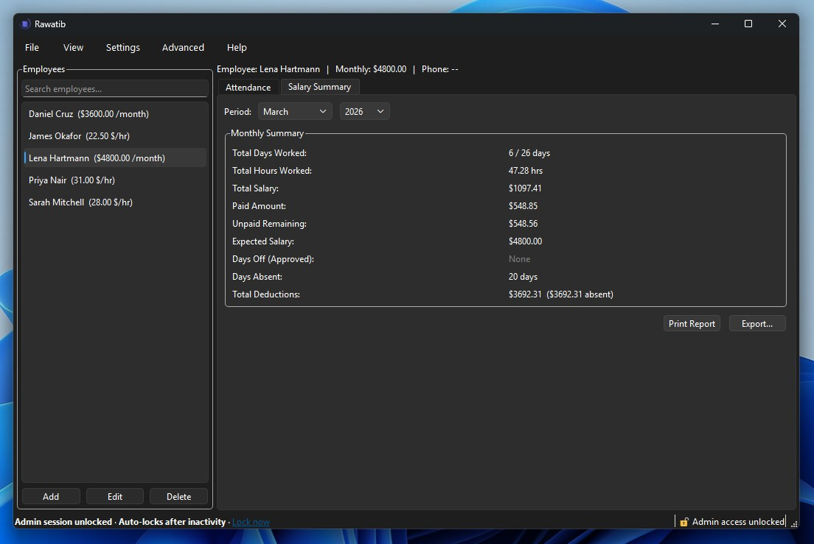
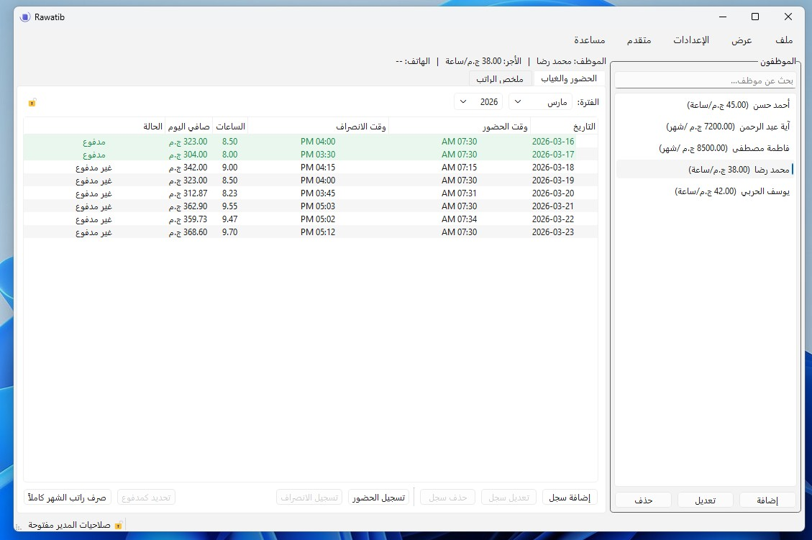

<div align="center">

# Rawatib — رواتب

**Employee Attendance & Payroll Manager**

*Track attendance, calculate wages, and manage salary payments — all in one encrypted desktop app.*


---

<!-- Screenshot placeholder -->
> 📸 *Screenshot — main window*
> 

</div>

---

## Table of Contents

- [Installation](#installation)
- [Features](#features)
- [Screenshots](#screenshots)
- [Dependencies](#dependencies)
- [Building from Source](#building-from-source)
  - [Windows](#windows)
  - [Linux](#linux)
  - [macOS](#macos)
- [Third-Party Setup](#third-party-setup)
- [Optional: XLSX Export](#optional-xlsx-export)
- [Adding a Language](#adding-a-language)
- [Command-Line Options](#command-line-options)
- [Data & Security](#data--security)
- [License](#license)
- [Acknowledgements](#acknowledgements)

---

## Installation

Rawatib 1.0.0 provides pre-built binaries for all three platforms. No compiler or Qt installation required.

**[Download Rawatib 1.0.0 from the Releases page](https://github.com/FakyLab/Rawatib/releases/tag/v1.0.0)**

---

### Windows

1. Download **`Rawatib-1.0.0-Setup.exe`** from the Releases page
2. Run the installer and follow the setup wizard
3. Launch **Rawatib** from the Start Menu or the desktop shortcut

> **Requirements:** Windows 10 or later, 64-bit

The installer includes all required DLLs (Qt runtime, OpenSSL, MinGW runtime). No additional software needs to be installed.

To uninstall: **Settings → Apps → Rawatib → Uninstall**, or run **Uninstall Rawatib** from the Start Menu folder. You will be asked whether to keep or delete your database and settings.

---

### Linux

Two package formats are available — pick whichever suits your setup.

#### Option A — AppImage (any distribution)

1. Download **`Rawatib-1.0.0-x86_64.AppImage`** from the Releases page
2. Make it executable and run it:

```bash
chmod +x Rawatib-1.0.0-x86_64.AppImage
./Rawatib-1.0.0-x86_64.AppImage
```

Self-contained — Qt and all dependencies are bundled inside. No installation or root access needed. Works on Ubuntu, Fedora, Arch, and any other distribution.

To uninstall: delete the AppImage file. Your database and settings remain in `~/.local/share/FakyLab/Rawatib/` — delete that folder too for a complete removal.

---

#### Option B — .deb package (Ubuntu / Debian)

1. Download **`rawatib_1.0.0_amd64.deb`** from the Releases page
2. Install it:

```bash
sudo dpkg -i rawatib_1.0.0_amd64.deb
```

3. Launch **Rawatib** from your app menu or run `rawatib` in a terminal

Installs system-wide to `/usr/lib/rawatib/`. Integrates with your desktop environment — app icon and launcher appear automatically.

To uninstall:

```bash
sudo apt remove rawatib
```

Your database and settings in `~/.local/share/FakyLab/Rawatib/` are not removed. Delete that folder manually for a complete removal.

> **Requirements:** Ubuntu 20.04 / Debian 11 or later, 64-bit, x86_64

---

### macOS

1. Download **`Rawatib-1.0.0.dmg`** from the Releases page
2. Open the `.dmg` file
3. Drag **Rawatib.app** into your **Applications** folder
4. Launch it from Applications or Spotlight

> **Requirements:** macOS 12 Monterey or later

On first launch macOS may show a security prompt because the app is not from the App Store. To open it:

- **Right-click** Rawatib.app → **Open** → **Open** in the dialog

Or allow it once via **System Settings → Privacy & Security → Open Anyway**.

To uninstall: drag **Rawatib.app** from Applications to the Trash. Your database and settings remain in `~/Library/Application Support/FakyLab/Rawatib/` — delete that folder too if you want a complete removal.

---

> 💡 If you prefer to build from source, see [Building from Source](#building-from-source).

---

## Features

### Employee Management
- Add, edit, and delete employees with name, phone, and notes
- Two pay types per employee: **Hourly** (hours × rate) and **Monthly Salary** (fixed salary with proportional deductions)
- Set expected check-in / check-out times and late tolerance per employee
- Per-employee 6–12 digit PIN for kiosk self-service
- Search employees instantly by name or phone number

### Attendance Tracking
- Record check-in and check-out times with per-session wage calculation
- Multiple sessions per day supported (morning shift, afternoon shift, overtime)
- Overlap detection — the app blocks conflicting sessions automatically
- Kiosk mode: employees check themselves in and out using their PIN
- Edit any record at any time — wages recalculate automatically on save

### Monthly Salary Deductions
Three configurable deduction modes for monthly employees:
- **Per-minute** — deducts proportionally for every minute late or early
- **Per-day penalty** — deducts a fixed percentage of the daily rate per occurrence
- **Off** — records late/early minutes for display only, no automatic deduction
- Configurable late tolerance per employee (grace period before deducting)
- Day Exceptions (holidays and approved leave) excluded from absent-day count

### Payroll Rules
- Define global recurring deductions and additions (social insurance, tax, bonuses, allowances)
- Two bases: **Fixed Amount** or **Percentage of Gross Pay**
- Separate rule sets for All Employees, Monthly-only, and Hourly-only
- Net pay = Gross Pay + Additions − Deductions, displayed in full breakdown

### Salary Summary
- Monthly summary per employee: total days, total hours, total salary, paid amount, unpaid remaining
- Full deduction breakdown: absent deductions, late deductions, early deductions, payroll rule adjustments
- Override payroll rule values for the current view without changing global defaults
- One-click "Pay Entire Month" marks all records as paid and prints a payment slip

### Export & Import
- Export monthly reports to **XLSX** (live spreadsheet with formulas) or **CSV**
- Import attendance from CSV — detects overlaps, wage mismatches, and unknown employees before writing anything
- Two-pass import: full preview with per-record conflict resolution before commit
- CSV always uses English headers so files exported in any language can be re-imported

### Print Reports
- Formatted monthly attendance report sized automatically for A4 or receipt paper
- Payment slip printed on "Pay Entire Month" confirmation
- Reports include attendance records, totals, deduction breakdown, and net pay

### Security
- Database encrypted with **AES-256 (SQLCipher)**
- Admin password protects all sensitive operations
- Configurable lock policy: choose exactly which actions require admin unlock
- Kiosk mode: employees use personal PINs — admin password never exposed
- Wage visibility control: hide salary figures from the screen when admin is locked
- Auto-lock: re-locks admin session after configurable inactivity timeout
- Brute-force protection: progressive lockout after 5 failed password attempts (30 s → 2 min → 2 h)
- Full tamper-evident audit log with integrity verification
- Emergency recovery file system for locked-out scenarios

### Localization
- Full **Arabic** interface with right-to-left layout
- **French, Turkish, Korean, Japanese, Chinese** (Simplified) translations included
- Language and layout direction switch instantly — no restart required
- CSV export always uses English headers regardless of active language

### Other
- Auto-backup on every launch (configurable interval)
- First-run setup: choose language and currency before the main window opens
- Discover Rawatib: 27 built-in tips accessible from Help menu
- Configurable currency symbol (appears everywhere — reports, exports, printed slips)
- Single-instance lock — prevents opening the app twice against the same database
- **Automatic update checker** — silent background check on launch badges the Help menu when a new version is available; manual check via Help → Check for Updates
- **Dark mode** — custom colors adapt to the system theme with live updates on mid-session theme change

---

## Screenshots

| | |
|---|---|
|  |  |
| *Monthly salary summary with deduction breakdown* | *Full Arabic right-to-left interface* |

---

## Dependencies

### Required for all platforms

| Dependency | Version | Purpose |
|---|---|---|
| **Qt 6** | 6.5 or later | UI framework, SQL, printing |
| **OpenSSL** | 3.x | Encryption backend for SQLCipher |
| **CMake** | 3.16 or later | Build system |
| **Git** | Any | Cloning submodules |

### Bundled (in `third_party/`)

| Dependency | How to get |
|---|---|
| **SQLCipher** amalgamation | Run `scripts/fetch_sqlcipher.sh` (requires `tclsh` and `git`) |
| **qsqlcipher** Qt SQL driver | Copy from Qt source — see [Third-Party Setup](#third-party-setup) |
| **qtkeychain** | Git submodule — run `git submodule update --init --recursive` |
| **QXlsx** *(optional)* | Clone into `third_party/QXlsx/` — see [Optional: XLSX Export](#optional-xlsx-export) |

### Platform-specific compilers

| Platform | Compiler |
|---|---|
| Windows | **MinGW-w64** (bundled with Qt installer, or MSYS2) |
| Linux | **GCC** or **Clang** (system package) |
| macOS | **Clang** via Xcode Command Line Tools |

---

## Building from Source

### Windows

**Requirements:** Qt 6 (MinGW component), OpenSSL, Git

#### Option A — Automated (recommended)

Double-click `build.bat` or run from Command Prompt:

```bat
build.bat
```

The script automatically:
1. Searches for Qt 6 on drives C, D, and E (and `QT_DIR` environment variable)
2. Finds the MinGW toolchain (Qt bundled or MSYS2)
3. Finds OpenSSL (Qt installer component, MSYS2, or standalone installer)
4. Finds Ninja if available (faster builds), falls back to MinGW Makefiles
5. Runs CMake configure and build
6. Runs `windeployqt` to copy Qt DLLs next to the executable

If multiple Qt installations are found, it asks you to choose.

**Output:** `build\Rawatib.exe`

---

#### Option B — Manual (Qt MinGW terminal)

Open the **Qt MinGW terminal** from the Start menu (e.g. "Qt 6.x.x MinGW 13.1.0 64-bit"), then:

```bat
git submodule update --init --recursive
scripts\fetch_sqlcipher.sh
mkdir build && cd build
cmake .. -DCMAKE_BUILD_TYPE=Release -G "MinGW Makefiles" -DCMAKE_PREFIX_PATH=%QT_DIR%
cmake --build . --config Release -j%NUMBER_OF_PROCESSORS%
windeployqt Rawatib.exe
```

---

#### Installing Qt on Windows

1. Download the Qt Online Installer from [qt.io/download-open-source](https://www.qt.io/download-open-source)
2. During installation, select:
   - **Qt 6.x.x → MinGW 13.1.0 64-bit**
   - **Developer and Designer Tools → MinGW 13.1.0 64-bit** (the compiler)
   - **Developer and Designer Tools → OpenSSL Toolkit** (recommended)
3. Optionally install Ninja for faster builds: `Qt → Developer and Designer Tools → Ninja`

#### Installing OpenSSL on Windows (if not using Qt's component)

- **MSYS2 (recommended):**
  ```bash
  pacman -S mingw-w64-ucrt-x86_64-openssl
  ```
- **Standalone installer:** Download "Win64 OpenSSL Light" from [slproweb.com](https://slproweb.com/products/Win32OpenSSL.html)

---

### Linux

#### Option A — Automated

```bash
chmod +x build.sh
./build.sh
```

The script detects your Qt installation, checks for OpenSSL, configures with CMake, and builds. It uses Ninja if available, otherwise falls back to Unix Makefiles.

**Output:** `build/Rawatib`

---

#### Option B — Manual

```bash
# Install dependencies (Ubuntu/Debian)
sudo apt install \
    cmake ninja-build git \
    qt6-base-dev qt6-tools-dev qt6-l10n-tools \
    libqt6network6-dev \
    libssl-dev tcl

# Install dependencies (Fedora/RHEL)
sudo dnf install \
    cmake ninja-build git \
    qt6-qtbase-devel qt6-qttools-devel \
    openssl-devel tcl

# Clone submodules and fetch SQLCipher
git submodule update --init --recursive
bash scripts/fetch_sqlcipher.sh

# Configure and build
mkdir build && cd build
cmake .. -DCMAKE_BUILD_TYPE=Release -G Ninja
ninja

# Run
./Rawatib

# Install system-wide (optional)
sudo cmake --install . --prefix /usr/local
```

---

#### Installing Qt on Linux

**Ubuntu/Debian:**
```bash
sudo apt install qt6-base-dev qt6-tools-dev qt6-l10n-tools qt6-base-private-dev libqt6printsupport6 libqt6network6-dev
```

**Fedora:**
```bash
sudo dnf install qt6-qtbase-devel qt6-qttools-devel qt6-qtbase-private-devel qt6-qtbase-devel
```

**From Qt installer** (if you need a specific version):
```bash
# After installing Qt, set QT_DIR before running build.sh:
export QT_DIR=/path/to/Qt/6.x.x/gcc_64/lib/cmake/Qt6
./build.sh
```

#### Distribution

For distributing the binary to machines without Qt installed, use `linuxdeployqt` or package as an AppImage:
```bash
# Install linuxdeployqt, then:
linuxdeployqt build/Rawatib -appimage
```

---

### macOS

#### Option A — Automated

```bash
chmod +x build.sh
./build.sh
```

The script auto-detects Homebrew Qt and OpenSSL, configures, builds, and runs `macdeployqt` to bundle Qt frameworks into the `.app`.

**Output:** `build/Rawatib.app`

---

#### Option B — Manual

```bash
# Install dependencies via Homebrew
brew install cmake ninja qt6 openssl git

# Set OpenSSL path (required — macOS ships LibreSSL, not OpenSSL)
export OPENSSL_ROOT_DIR=$(brew --prefix openssl)

# Set Qt path
export QT_DIR=$(brew --prefix qt6)/lib/cmake/Qt6

# Clone submodules and fetch SQLCipher
git submodule update --init --recursive
bash scripts/fetch_sqlcipher.sh

# Configure and build
mkdir build && cd build
cmake .. \
    -DCMAKE_BUILD_TYPE=Release \
    -DCMAKE_PREFIX_PATH="$(brew --prefix qt6)" \
    -DOPENSSL_ROOT_DIR="$OPENSSL_ROOT_DIR" \
    -G Ninja
ninja

# Bundle Qt frameworks into the .app
macdeployqt Rawatib.app

# Run
open Rawatib.app
```

---

#### Installing Qt on macOS

```bash
# Via Homebrew (simplest)
brew install qt6

# Or download the Qt installer from qt.io and install the macOS component.
# After installing, set QT_DIR before running build.sh:
export QT_DIR=~/Qt/6.x.x/macos/lib/cmake/Qt6
./build.sh
```

> **Note:** macOS ships LibreSSL which does not work with SQLCipher. Always install OpenSSL via Homebrew and set `OPENSSL_ROOT_DIR`.

---

## Third-Party Setup

Before the first build, three bundled dependencies need to be prepared:

### 1 — SQLCipher amalgamation

```bash
bash scripts/fetch_sqlcipher.sh
```

Requires `git` and `tclsh`:
```bash
# Ubuntu/Debian
sudo apt install git tcl

# macOS
brew install git tcl-tk

# Windows/MSYS2
pacman -S git tcl
```

This clones SQLCipher, generates the amalgamation (`sqlite3.c` + `sqlite3.h`), and places them in `third_party/sqlcipher/`. Only needs to run once unless you upgrade SQLCipher.

---

### 2 — qsqlcipher Qt SQL driver

Copy these two files from your Qt source into `third_party/qsqlcipher/`:

| Source path | Destination |
|---|---|
| `$QTDIR/Src/qtbase/src/plugins/sqldrivers/sqlite/qsql_sqlite.cpp` | `third_party/qsqlcipher/qsql_sqlite.cpp` |
| `$QTDIR/Src/qtbase/src/plugins/sqldrivers/sqlite/qsql_sqlite_p.h` | `third_party/qsqlcipher/qsql_sqlite_p.h` |

On Windows with the Qt installer, the source is typically at:
```
C:\Qt\6.x.x\Src\qtbase\src\plugins\sqldrivers\sqlite\
```

On Linux with the `qt6-base-private-dev` package:
```
/usr/include/x86_64-linux-gnu/qt6/QtSql/private/
```

---

### 3 — qtkeychain submodule

```bash
git submodule update --init --recursive
```

This clones qtkeychain into `third_party/qtkeychain/`. Required for storing the admin password key securely in the OS keychain (Windows Credential Manager, macOS Keychain, Linux Secret Service / kwallet).

---

## Optional: XLSX Export

XLSX export is disabled by default. To enable it:

1. Clone QXlsx into `third_party/`:
   ```bash
   git clone https://github.com/QtExcel/QXlsx.git third_party/QXlsx
   ```

2. Re-run CMake configure:
   ```bash
   cd build && cmake ..
   ```

CMake detects `third_party/QXlsx/QXlsx/CMakeLists.txt` automatically and prints:
```
-- QXlsx found -- XLSX export enabled
```

Without QXlsx, Export only offers CSV. The UI adapts automatically — no rebuild needed to switch between the two modes.

---

## Adding a Language

1. **Register the language** in `src/utils/LanguageRegistry.cpp` — add one entry to `s_languages` with the ISO 639-1 code, native name, and RTL flag.

2. **Generate the skeleton** `.ts` file:
   ```bash
   lupdate path/to/project -ts translations/rawatib_<code>.ts
   ```

3. **Translate** the strings using Qt Linguist or any text editor.

4. **Drop the file** in `translations/`. CMake picks it up automatically on the next configure — no `CMakeLists.txt` edit needed.

5. **Optionally add** `qtbase_<code>.qm` from your Qt installation to translate standard dialog buttons (OK, Cancel, Close, etc.). Drop it in `translations/` — CMake detects it automatically.

6. **Rebuild.**

See `translations/README.md` for the full checklist and RTL notes.

---

## Command-Line Options

These flags are available when launching from the terminal or a shortcut. All are optional.

| Flag | Description |
|---|---|
| `--lang <code>` | Override UI language for this session only (`en`, `ar`, `fr`, `tr`, `ko`, `ja`, `zh`). Does not save. |
| `--db-path <path>` | Use a different database file for this session. Does not affect saved settings. |
| `--dev-mode` | Enable the Developer menu in the menu bar. |
| `--reset` | Clear all saved settings (language, timeout, payroll toggle) and restart. Database is untouched. |
| `--reset-all` | **Destructive.** Delete the database and all settings, then restart. One confirmation required. Use as a last resort when locked out with no recovery file. |
| `--bypass-key --recovery-file <path>` | Emergency access recovery. Removes the admin password using the recovery file generated at password setup. Database and all data remain intact. |

**Examples:**

```bash
# Windows
Rawatib.exe --lang ar
Rawatib.exe --bypass-key --recovery-file "D:\backup\rawatib.rwtrec"

# Linux / macOS
./Rawatib --lang fr
./Rawatib --reset
```

---

## Data & Security

### Database location

| Platform | Default path |
|---|---|
| Windows | `C:\Users\<user>\AppData\Roaming\FakyLab\Rawatib\attendance.db` |
| Linux | `~/.local/share/FakyLab/Rawatib/attendance.db` |
| macOS | `~/Library/Application Support/FakyLab/Rawatib/attendance.db` |

Override with `--db-path` for a custom location.

### Encryption

The database is encrypted with AES-256 via SQLCipher. The encryption key is derived from the admin password and stored in the OS keychain (Windows Credential Manager, macOS Keychain, Linux Secret Service). Without the password, the database file cannot be opened.

### Auto-backup

On every launch, Rawatib creates a timestamped backup if more than 24 hours have passed since the last backup. Backups are stored in the same directory as the database. Access them from **File → Open Auto-Backup Folder**.

### Recovery

If you forget your admin password:
1. If you have the recovery file (generated at password setup via **Settings → Admin Password → Generate Recovery File**):
   ```bash
   Rawatib.exe --bypass-key --recovery-file path/to/file.rwtrec
   ```
2. If you have no recovery file but still have database access: export all employees to CSV via **File → Export**, then use `--reset-all` to wipe and start fresh, then re-import the CSVs. Attendance history is preserved.

---

## License

Rawatib is licensed under the **GNU General Public License v3.0**. See [`resources/LICENSE.txt`](resources/LICENSE.txt) for the full text.

Third-party libraries used:
- **Qt 6** — LGPL v3
- **SQLCipher** — BSD-style (see [`resources/THIRD_PARTY_LICENSES.txt`](resources/THIRD_PARTY_LICENSES.txt))
- **qtkeychain** — BSD 2-Clause
- **QXlsx** (optional) — MIT

---

## Acknowledgements

**Mohammed Reda** — for testing Rawatib and for the inspiration behind the Discover Rawatib tips dialog.

**Qt, SQLCipher, qtkeychain, and QXlsx** — the open source libraries that make Rawatib's UI, encryption, credential storage, and Excel export possible. See the [License](#license) section for details.

---

<div align="center">

Made by [FakyLab](https://github.com/FakyLab) · GPLv3

</div>
